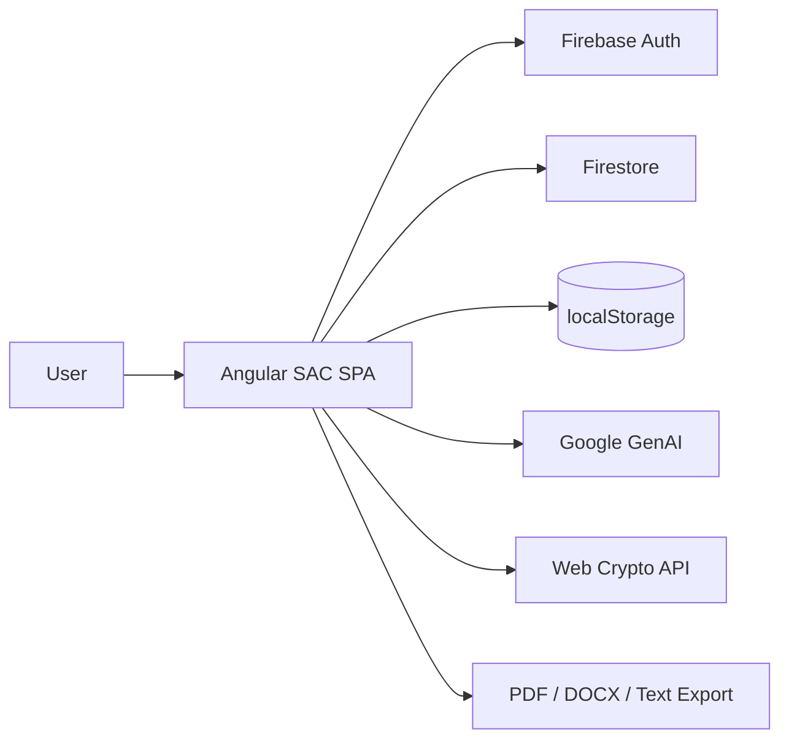
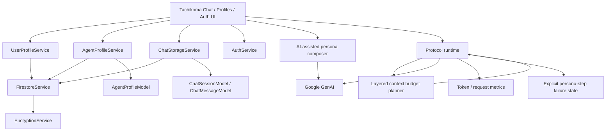
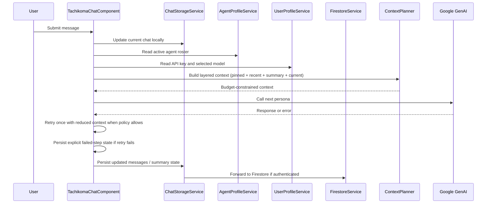

# Architecture.md

| Version | Status | Date | Owner |
| :---- | :---- | :---- | :---- |
| 1.3 | Draft | 2026-05-29 | Watson (Architect) |

## Revision Notes

- v1.3 introduces a simplified persona authoring path (AI-first basic mode), layered context budgeting, and explicit agent-failure handling.
- v1.3 clarifies quota behavior by separating API subscription assumptions from API-project quota reality.
- v1.1 captures the live codebase as the source of truth rather than older reference material.
- The document now emphasizes the current Angular route surface, service boundaries, and model normalization contract.
- Canonical data modeling is separated into a dedicated spec to keep this architecture document strategic.

## 1. System Overview

Stand Alone Chat (SAC) is an Angular 20 single-page application that combines multi-agent chat orchestration, user/auth state, local-first persistence, and optional Firebase-backed cloud sync. The live codebase already behaves like a stateful workspace product: users can authenticate, manage API keys and profiles, create and resume chat sessions, and run a sequential multi-agent protocol with silence filtering and moderator synthesis.

The architecture is intentionally frontend-heavy. The live app is composed of standalone Angular components, service-layer business logic, and TypeScript models that act as the core domain contract. Firestore is used as a cloud extension of localStorage rather than as the primary state store, and the app can operate offline or in anonymous mode with reduced capabilities.

From an architectural perspective, the most important boundary is not UI vs backend, but domain state vs transport. The app’s current state management, persistence, and protocol orchestration are concentrated in the component/service/model layer. That makes the system flexible, but it also means future improvement work should focus on clearer module boundaries, stronger canonical data contracts, and better separation of protocol logic from page UI.

In v1.3, the target operational shape is: fast persona onboarding by AI draft, deterministic context assembly under token budgets, and resilient protocol execution that surfaces failures instead of silently skipping personas.

This document is intentionally subordinate to [CONSTRAINTS.md](CONSTRAINTS.md). When this architecture and the constraints disagree, the constraints file wins and this document should be updated to match.

## 2. Technology Stack

| Tool / Library / Service | Version | Purpose | Constraint Reference |
| :---- | :---- | :---- | :---- |
| Angular | 20 | SPA framework, standalone components, signals, routing | [CONSTRAINTS.md §2](CONSTRAINTS.md#2-core-platform-constraints) |
| TypeScript | Workspace default | Application language and domain model definitions | Live codebase baseline |
| Firebase Authentication | Current | Email/password, Google, anonymous auth | [CONSTRAINTS.md §2](CONSTRAINTS.md#2-core-platform-constraints) |
| Firestore | Current | Optional cloud sync and cross-device persistence | [CONSTRAINTS.md §4](CONSTRAINTS.md#4-state-persistence-and-sync-constraints) |
| localStorage | Browser API | Immediate persistence and offline-first state | [CONSTRAINTS.md §4](CONSTRAINTS.md#4-state-persistence-and-sync-constraints) |
| Web Crypto API | Browser API | AES-GCM encryption for API keys | [CONSTRAINTS.md §9](CONSTRAINTS.md#9-security-constraints) |
| @google/genai | Current | Gemini model access and token counting | [CONSTRAINTS.md §2](CONSTRAINTS.md#2-core-platform-constraints) |
| Angular Material | Current | Dialogs, sidenav, form controls, UI primitives | [CONSTRAINTS.md §7](CONSTRAINTS.md#7-ui--ux-library-constraints) |
| Angular CDK | Current | Foundational interaction primitives | [CONSTRAINTS.md §7](CONSTRAINTS.md#7-ui--ux-library-constraints) |
| ngx-scrollbar | Current | Scroll behavior/custom scrollbar UI | [CONSTRAINTS.md §7](CONSTRAINTS.md#7-ui--ux-library-constraints) |
| ngx-translate | Current | Locale/i18n support | [CONSTRAINTS.md §7](CONSTRAINTS.md#7-ui--ux-library-constraints) |
| jsPDF / docx / file-saver / marked | Current | Export and markdown rendering utilities | [CONSTRAINTS.md §2](CONSTRAINTS.md#2-core-platform-constraints) |

## 3. Monorepo Structure

The repository is a single Angular application workspace, not a multi-package monorepo. The core architectural surfaces are organized as follows:

```text
docs/
  context/
    Architecture.md
    CanonicalDataModelSpec.md
    DECISION_LOG.md
    PRD.md
    ProjectBrief.md
  stories/
    AUTH/
    AGNT/
    CHAT/
    ORCH/
    SYNC/
    OPER/
src/
  app/
    layouts/
    pages/
    services/
    models/
    components/
  assets/
  environments/
  reference/
public/
scripts/
```

## 3.1 Runtime Entry Points

- [src/app/app.routes.ts](src/app/app.routes.ts) defines the authenticated shell and authentication shell.
- [src/app/app.config.ts](src/app/app.config.ts) wires Firebase, routing, animations, translation, and service worker support.
- The main user-facing routes are `/dashboard`, `/tachikoma`, `/tachikoma-profiles`, `/profile`, and `/authentication/*`.

## 4. Module Breakdown

### AUTH - Identity, Access, and Secure Configuration

Current components and services: `AuthService`, `UserProfileService`, login/register/auth routes, profile page, API-key sync dialog. This module handles Firebase auth, anonymous mode, user-profile persistence, API-key validation, and cloud/local key sync.

Key stories: AUTH-001, AUTH-002, AUTH-003.

Architectural note: logout clears local browser state but does not delete Firestore cloud records.

### AGNT - Agent Profiles and Instruction Design

Current components and services: `TachikomaProfilesComponent`, `AgentProfileService`, `AgentProfileModel`. This module handles persona CRUD, system instruction authoring, per-agent model selection, silence protocol configuration, and default agent templates.

Key stories: AGNT-001, AGNT-002, AGNT-003, AGNT-004.

Architectural note: profile snapshots are normalized on load from both localStorage and Firestore, then preserved when chats snapshot participating agents.

v1.3 requirement: persona creation defaults to an AI-assisted basic mode (`describe persona -> draft profile`), while form/XML/plaintext structured editing remains an advanced mode for expert tuning.

### CHAT - Chat Session Lifecycle and Workspace Organization

Current components and services: `TachikomaChatComponent`, `ChatStorageService`, `ChatSessionModel`, `ChatMessageModel`. This module handles chat creation, metadata editing, selected-agent snapshots, history switching, and export.

Key stories: CHAT-001, CHAT-002, CHAT-003.

Architectural note: `roundId` is part of the live message contract and should be treated as a first-class protocol field.

### ORCH - Multi-Agent Conversation Protocol

Current components and services: `TachikomaChatComponent`, `GoogleGenAI` call path, model/silence logic inside the chat page, markdown rendering. This module handles the round-robin protocol, randomized chatter ordering, silence suppression, moderator synthesis, and shared context construction.

Key stories: ORCH-001, ORCH-002, ORCH-003, ORCH-004.

Architectural note: orchestration is currently embedded in the chat component and should be extracted into a dedicated service boundary in a later revision.

v1.3 requirement: context assembly must use a deterministic layering policy with token budgets: pinned facts + rolling recent rounds + compact session summary + current user turn.

### SYNC - Persistence, Offline Continuity, and Cross-Device Recovery

Current components and services: `FirestoreService`, `ChatStorageService`, `AgentProfileService`, `UserProfileService`, `AuthService`. This module handles local-first writes, Firestore forwarding, offline persistence, merge strategy selection, and cross-device restore.

Key stories: SYNC-001, SYNC-002, SYNC-003, SYNC-004.

Architectural note: localStorage is the immediate source of truth; Firestore is a forwarded cloud mirror for authenticated users.

v1.3 requirement: SAC Firestore data must be stored in a dedicated Firestore database (for example, `sac`) to avoid collisions in shared Firebase projects.

### OPER - Operational Guardrails, Quotas, and Quality Signals

Current components and services: `TachikomaChatComponent`, model metrics, request metrics, token counters, rate-limit/retry logic. This module handles token governance, daily/per-minute throttling, validation warnings, and telemetry for quality/performance.

Key stories: OPER-001, OPER-002, OPER-003.

Architectural note: rate limiting is currently client-enforced and should be treated as advisory rather than authoritative.

v1.3 requirement: protocol failures must be explicit in transcript state, with bounded retry and reduced-context fallback before the system marks a persona step as failed.

## 5. Data Models

The live code already defines the key domain models in `src/app/models`. The architectural rule is that these TypeScript models are the source of truth, and persistence code must normalize to them rather than inventing alternate document shapes. This is enforced by [CONSTRAINTS.md §6](CONSTRAINTS.md#6-data-model-constraints).

Model family summary:

- `SyncableData`: base contract for cloud-synced entities.
- `UserProfile`: identity, API-key, model, and rate-limit settings.
- `AgentProfile`: persona configuration, system prompt mode, model override, silence mode.
- `ChatSession`: conversation container with summary, participants, and timestamps.
- `ChatMessage`: message record with markdown HTML and optional agent metadata.
- `SystemFields`: structured prompt authoring fields for form/XML modes.

The canonical data model spec is documented separately in [CanonicalDataModelSpec.md](CanonicalDataModelSpec.md).

Architectural rule: `createdAt` is treated as a practical persistence field even where the base interface currently only mandates `updatedAt`, because [CONSTRAINTS.md §6](CONSTRAINTS.md#6-data-model-constraints) requires syncable entities to preserve both timestamps.

## 6. API & Integration Design

### Firebase/Auth and Cloud Integration

| Name | Trigger Type | Input Shape | Output Shape | Auth Requirement |
| :---- | :---- | :---- | :---- | :---- |
| Firebase email/password auth | Client action | email, password | Auth user credential | Required |
| Firebase anonymous auth | Client action | none | Anonymous auth credential | None |
| Google sign-in | Client action | provider popup | Auth user credential | Required |
| Firestore user profile sync | Service write | `UserProfile` | Persisted doc | Authenticated for cloud |
| Firestore agent sync | Service write | `AgentProfile` | Persisted doc | Authenticated for cloud |
| Firestore chat sync | Service write | `ChatSession` | Persisted doc | Authenticated for cloud |
| API-key encryption | Service transform | plaintext key + user id | AES-GCM ciphertext | Authenticated/cloud |

### Firestore Database Isolation Policy

- SAC data uses a dedicated Firestore database (for example, database id `sac`).
- Canonical paths inside the SAC database:
  - `/users/{userId}/chat_sessions/{chatId}`
  - `/users/{userId}/agent_profiles/{agentId}`
  - `/users/{userId}/user_profile/{userId}`

### Runtime Model/Protocol Integration

| Name | Trigger Type | Input Shape | Output Shape | Auth Requirement |
| :---- | :---- | :---- | :---- | :---- |
| Gemini model call | User chat turn | prompt + context + agent config | structured text/JSON response | BYOK / valid key |
| Persona draft generation | User persona intent | freeform persona description | draft `AgentProfile` shape | BYOK / valid key |
| Token counting | Pre-request | contents + model | token usage metrics | BYOK / valid key |
| Context budget planner | Pre-request | current chat state + limits | trimmed layered context payload | None |
| Persona-step retry policy | Runtime policy | failed agent call + fallback context | retry or explicit failed step state | None |
| Chat export | Client action | current chat session | PDF/text/docx artifact | None |

## 7. Security Model

Auth is Firebase-backed with three usable modes: email/password, Google, and anonymous. Anonymous use is deliberately supported, but cloud sync and encrypted backup become meaningful only when the user authenticates.

Firestore is isolated per user and is used as a backing store for chats, profiles, and user settings. LocalStorage remains the immediate source for session continuity, which means the security posture is browser-first rather than server-first.

API keys are encrypted before Firestore upload using AES-GCM with PBKDF2-derived keys from the user ID and a static app salt. The same key material is used to decrypt when reading from the cloud. This is sufficient for a client-side SPA, but it is not equivalent to server-managed secret storage.

OWASP-relevant concerns in this app are XSS, sensitive-data exposure in browser storage, account/session handling, and unsafe sync assumptions. The current mitigation path is input sanitization, key encryption in Firestore, Firebase auth isolation, and explicit local/cloud boundary handling. A stronger CSP and a more explicit sync/conflict UX are recommended improvements.

v1.3 security and reliability clarification: API usage entitlement must be treated as API-project specific quota and billing state; app-level subscriptions alone are not a reliable enforcement signal for runtime quota expectations.

## 8. System Diagrams

### 8a. System Context



### 8b. Component / Module Interaction



### 8c. Primary Data Flow



## 9. Performance & Scalability

The current app is already optimized around local immediacy: state updates happen in memory/localStorage first, and cloud persistence is deferred. That keeps the UX responsive even when Firestore is unavailable.

The main performance pressure is the O(n) agent protocol. Every user message can trigger multiple model calls, plus optional title generation and token counting. Scalability therefore depends more on protocol policy, rate limiting, and context-window discipline than on page rendering.

Recommended strategies:

- Keep local-first writes and avoid blocking cloud round trips.
- Preserve the current sequential protocol until a rate-limited parallel strategy is explicitly designed.
- Keep structured chat summaries and round-based context trimming as the primary defense against context growth.
- Enforce layered context budgets so payload growth is bounded by policy, not by conversation length.
- Prefer deterministic trimming order (oldest raw rounds first) while preserving pinned facts and latest user turn.
- Treat token/rate-limit telemetry as a first-class operational feature.
- Use model overrides intentionally so expensive models are not used for every agent by default.

These strategies are subject to the performance and security constraints defined in [CONSTRAINTS.md](CONSTRAINTS.md).

## 10. Current-State Gaps

These are the highest-value improvements to consider next:

- Extract protocol orchestration and context planning out of the page component into dedicated services.
- Add AI-assisted basic persona creation with optional advanced editing mode.
- Formalize the model contract around `SyncableData`, created/updated timestamps, and per-entity normalization.
- Introduce explicit conflict-resolution semantics for sync merges.
- Add a stronger UI-visible quota/token dashboard and make quota-source assumptions explicit.
- Make silence behavior more explicit and less string-fragile.
- Complete implementation-level alignment for dedicated SAC Firestore database selection across all services.
